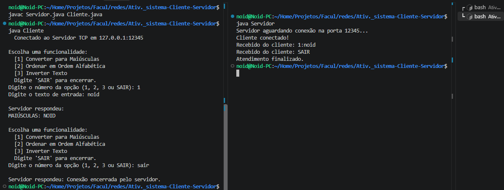

# Sistema Cliente/Servidor TCP em Java p/ Redes

Aplicação de arquitetura **Cliente/Servidor** desenvolvida em **Java** para a atividade prática de Redes de Computadores. O sistema utiliza a biblioteca nativa de Sockets (`java.net`) sobre o protocolo de transporte **TCP**.

---

## Funcionalidades

O sistema permite que o cliente envie requisições de processamento de texto ao servidor e receba o resultado em tempo real no terminal.

Dispõe das seguintes opções:
- **`[1]` Maiúsculas:** Converte o texto enviado para letras maiúsculas.
- **`[2]` Ordem Alfabética:** Reorganiza os caracteres do texto em ordem alfabética.
- **`[3]` Inverter Texto:** Inverte a ordem dos caracteres da mensagem.
- **`SAIR`:** Encerra a conexão entre o cliente e o servidor.

---

## Requisitos

- **Java JDK** 11 ou superior instalado.

---

## Como Executar



### 1. Compilar os Arquivos
Abra o terminal na pasta do projeto e compile os dois ficheiros:
```bash
javac Servidor.java Cliente.java
```
### 2. Iniciar o Servidor
No primeiro terminal, execute o servidor para aguardar conexões:
```bash
java Servidor
```
### 3. Iniciar o Cliente
Em outro terminal (na mesma pasta), inicie o cliente:
```bash
java Cliente
```

O cliente exibirá o menu interativo. Você pode realizar quantas operações desejar em sequência. Para finalizar a conexão e encerrar a aplicação, digite SAIR.

&copy; DIMAp/UFRN